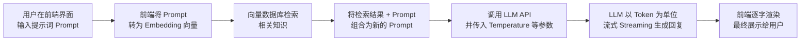

## 针对前端开发中常遇到的AI相关名词

| 术语 | 英文 | 前端视角的简要解释 | 补充说明 |
|------|------|------------------|----------|
| **Token** | Token | 模型处理文本时的**最小语义单元**。可以是一个单词、词的一部分，或一个字符。前端调用API时，输入+输出的总token数通常就是**计费单位**。 | 例如，“ChatGPT”可能被拆成"Chat"、"G"、"PT"三个token。不同模型的切分方式不同。前端需注意控制token数量以避免超限和降低成本。 |
| **LLM** | Large Language Model (大语言模型) | 一个通过海量文本训练出来的**巨型神经网络**，能理解并生成自然语言。前端调用其API（如GPT、Gemini、文心一言）来实现对话、总结、代码生成等功能。 | LLM本身不包含业务数据，你需要通过提示词或外部知识库（RAG）给它提供上下文。 |
| **Prompt** | 提示 / 提示词 | 你向LLM发送的**输入文本**。在前端，就是你设计给用户填写问题的那个输入框里的内容。提示词的质量直接决定输出结果的好坏。 | “提示工程”就是设计更有效的prompt，例如加入角色设定、输出格式要求等，可显著提升效果。 |
| **Streaming** | 流式输出 | LLM**逐字或逐词生成**并返回响应的方式，而不是等全部生成完再一次性返回。前端通过流式API（如SSE、WebSocket）实现类似ChatGPT的**逐字打印效果**。 | 显著提升用户体验，避免长时间白屏等待。前端需处理异步数据流和内容的逐步渲染。 |
| **Completion** | 补全 | 让模型根据输入的prompt**续写**出后续内容。这是早期API（如OpenAI的text-davinci系列）的主要模式。 | 现在对话模型更常用`/chat/completions`接口，但底层仍是基于补全逻辑实现的。前端常看到的“代码自动补全”功能就是一种应用。 |
| **Embedding** | 向量嵌入 / 嵌入向量 | 将文本转换成一串**固定长度的浮点数数组**（向量）。语义相似的文本，其向量在空间中的距离就很近。前端通常将用户查询转为向量，去向量数据库中检索相关内容。 | 这是实现RAG（检索增强生成）的基础，用于让LLM能够访问你的私有知识库（如公司文档、产品手册）。 |
| **Temperature** | 温度 | 一个控制LLM**输出随机性**的参数（0~1之间）。值越低，输出越确定、保守；值越高，输出越多样、有创意。前端可以通过滑块或下拉框让用户调节此参数。 | Temperature=0适合事实性问答；=0.8~1适合故事创作或头脑风暴。 | |
| **Context Window** | 上下文窗口 | 模型一次能处理的**最大token数**（包括输入和输出）。比如GPT-4 turbo支持128k token。前端需要估算用户对话历史+新输入的总token数，避免超出窗口限制。 | 超出窗口后，模型会“忘记”最早的信息。前端可以截断历史或压缩总结来管理上下文。 | |
| **RAG** | Retrieval-Augmented Generation (检索增强生成) | 先检索相关文档，再让LLM根据这些文档生成答案的技术流程。前端涉及两步：1）将用户问题转为向量并检索相似内容；2）将检索结果+问题一起发给LLM。 | 可以解决LLM知识陈旧和幻觉问题，是构建“公司文档问答机器人”的常用架构。 | |
| **Function Calling** | 函数调用 / 工具调用 | 让LLM判断什么时候需要调用你定义的**外部函数**（如获取天气、查询数据库），并以结构化参数（JSON）返回该请求。前端收到后执行相应函数，再将结果返回给LLM。 | 这是让LLM与外部世界交互的关键能力，可以实现订票、查库存、发邮件等操作。前端需实现函数注册和调用路由。 |

**特别说明**：对于前端工程师而言，日常工作中接触到的AI概念和展示给用户的AI功能往往存在层级差异，可以参考以下流程理解：

## 国内外开发常用的AI编辑器

| 工具名称 | 类型 | 底层模型 | 核心特点 | 适用场景 |
| :--- | :--- | :--- | :--- | :--- |
| **Cursor** | AI原生IDE | GPT-5、Claude Opus/Sonnet 4.5 | 深度集成AI的VS Code分支，支持Agent模式自动执行任务，Tab补全行业标杆 | 全栈开发、快速原型、跨技术栈项目 |
| **Claude Code** | CLI终端工具 | Claude Sonnet 4.5 / Opus 4.5 | "代理式编程鼻祖"，采用六层架构（MCP/SubAgents/Hooks），可自主完成端到端开发闭环 | 复杂工程任务、大型重构、CI/CD集成 |
| **GitHub Copilot** | IDE插件 | GPT-5.5、Codex | 最早普及的AI编程助手，深度绑定GitHub生态（可读issues/PRs/wiki），支持组织级安全管控 | 日常编码辅助、国际开源项目开发 |
| **腾讯云代码助手** | IDE插件 | 混元 + DeepSeek 双引擎 | 支持MCP协议可连接TAPD等外部系统，工程级代码理解，安全审计（自动检测SQL注入） | 企业级项目、国内生态集成 |
| **通义灵码** | IDE插件 | 通义千问系列 | 阿里云SDK深度优化，支持私域知识库接入 | 电商/支付系统、企业级Java开发 |
| **Trae** | AI原生IDE | 豆包大模型 | 中文设计稿转代码，Builder模式从自然语言生成项目结构 | 前端快速原型、中文开发环境 |
| **Windsurf** | AI原生IDE | Cascade模型 | 代理式多文件编辑，擅长处理大型代码库的自动编辑任务 | 大型项目架构优化、后端逻辑开发 |
| **Bolt.new** | 浏览器平台 | 自有模型 | 基于WebContainers的浏览器内全栈运行，无需本地环境 | 快速原型验证、前端教学演示 |
| **Lovable** | 云端平台 | 自有模型 | 对话式生成全栈Web应用（前端+后端+数据库+认证），支持导出GitHub | MVP构建、创业项目快速落地 |
| **Vercel v0** | 云端平台 | 自有模型 | 从自然语言生成精美React UI组件，输出Tailwind + shadcn/ui代码 | UI组件快速迭代、设计驱动开发 |
| **百度秒哒** | 无代码平台 | 文心大模型 | 中文自然语言驱动，内置十余个专业智能体（策划/开发/测试），支持微信小程序 | 零门槛应用开发、本土化AI建站 |

> **补充说明**：文中部分工具（如**Bolt.new、Lovable、Vercel v0**）更多定位于应用/网站构建平台，而非纯粹的代码/文本编辑器。此处一并列出，便于开发者根据自身需求进行选型参考。

## AI编辑器快速选型建议
| 你的情况 | 推荐工具 | 理由 |
| :--- | :--- | :--- |
| **追求极致AI编程能力** | Claude Code（CLI）+ Cursor（IDE） | Claude Code终端代理能力最强，Cursor IDE体验最好 |
| **日常编码、习惯IDE插件** | GitHub Copilot 或 通义灵码 | 成熟稳定，生态完善 |
| **国内企业、需私有化部署** | 腾讯云代码助手 或 通义灵码 | 支持私有化，满足数据合规 |
| **零基础快速建站/原型** | Bolt.new、Lovable、百度秒哒 | 浏览器内对话即可生成完整应用 |
| **预算有限、喜欢开源** | OpenCode + DeepSeek API 或 Continue + 本地Ollama | 工具免费，可结合低成本模型 |
| **UI组件快速生成** | Vercel v0 | 最适合单组件/页面级UI快速产出 |

## AI聊天与办公助手工具

| 工具名称 | 提供商 | 常用模型 | 核心特点 | 适用场景 |
| :--- | :--- | :--- | :--- | :--- |
| **ChatGPT** | OpenAI | GPT-5.4  | 综合能力强，多模态，生态完善 | 通用问答、文档总结、创意写作 |
| **Claude** | Anthropic | Claude Opus 4.6 / Sonnet 4.5  | 逻辑推理强，深度分析 | 专业分析、长文档处理 |
| **Gemini** | Google | Gemini 3.1 / 2.5 Pro  | 整合谷歌生态（Gmail、Docs） | 谷歌生态内用户 |
| **DeepSeek** | 深度求索 | DeepSeek R1/V3  | 中文场景顺手，文档总结快 | 中文办公、资料整理 |
| **通义千问** | 阿里巴巴 | Qwen 系列  | 与钉钉集成，团队协作效率提升 | 企业内部办公 |
| **Kimi** | 月之暗面 | Moonshot 系列  | 超长文本处理（5000+字报告快速总结） | 长文档分析、论文阅读 |
| **文心一言** | 百度 | ERNIE 系列  | 中文理解最好，知识图谱丰富 | 中文知识问答、搜索增强 |
| **讯飞星火** | 科大讯飞 | 星火认知模型  | 语音输入强，会议转写 | 会议记录、语音场景 |

## 国内外主流AI大语言模型与厂商

### 🌐 国际

| 厂商 | 代表模型 | 国家/地区 | 核心特点与适用场景 |
| :--- | :--- | :--- | :--- |
| **OpenAI** | GPT系列 (GPT-4o, GPT-5) | 美国 | **通用能力标杆**。在复杂推理、代码生成等任务上表现领先。产品形态丰富（如ChatGPT），适合广泛的通用场景，但模型闭源。 |
| **谷歌 (Google)** | Gemini系列 (Gemini Ultra 2.0) | 美国 | **多模态能力突出**。原生支持文本、图像、视频和音频理解。深度集成Google Workspace，适合需要处理多模态信息或与谷歌生态结合的场景。 |
| **Anthropic** | Claude系列 (Claude 3.5/4.0) | 美国 | **以安全可控著称**。采用“宪法AI”进行训练，在金融、法律等对安全性和合规性要求极高的专业领域表现优异。 |
| **Meta** | LLaMA系列 (LLaMA 3.5) | 美国 | **开源生态的代表**。模型权重向研究社区开放，促进了下游应用的创新。适合学术研究或希望在自有基础设施上进行定制开发的企业。 |
| **微软 (Microsoft)** | Copilot | 美国 | **深度集成于生产力工具**。将GPT系列模型融入Office、Windows、GitHub等软件，作为AI助手提供服务。适合微软生态内的用户提升工作效率。 |
| **Mistral AI** | Mistral Large系列 | 法国 | **欧洲的开源力量**。以高性能、高性价比的开源模型著称，并强调数据主权。适合对数据合规性和成本敏感、青睐开源技术的欧洲及全球开发者。 |

### 🇨🇳 国内

| 厂商 | 代表模型 | 核心特色 | 典型适用场景 |
| :--- | :--- | :--- | :--- |
| **深度求索 (DeepSeek)** | DeepSeek系列 | 技术标杆、极致性价比、数学/代码能力突出 | - **代码生成与辅助编程**：适合开发者使用，可自动生成、解释、调试代码 - **数学与逻辑推理**：教育辅导、科研辅助、金融分析等需要严谨推理的任务 - **成本敏感的高频调用场景**：如客服机器人、内容批量处理，因其API定价极低 |
| **阿里巴巴 (阿里云)** | 通义千问 (Qwen) 系列 | 全球顶级的开源生态、企业级服务能力 | - **企业级应用集成**：通过阿里云服务嵌入电商、物流、办公系统（如钉钉） - **开源二次开发**：开发者可基于Qwen开源模型定制垂类应用（如法律、医疗咨询） - **多模态内容生成**：通义万相支持文生图、文生视频 |
| **字节跳动 (火山引擎)** | 豆包大模型 | 商业落地广泛、推理成本低、Agent平台成熟 | - **短视频与内容平台**：文案生成、评论分析、视频脚本创作（深度集成抖音、头条） - **企业智能体 (Agent)**：通过Coze扣子平台搭建自动化工作流，如客服、销售助手 - **高并发、低成本场景**：海量用户交互，如社群运营、游戏NPC对话 |
| **智谱AI** | GLM系列 | 技术均衡、商业化成熟、首个IPO启动 | - **通用企业服务**：金融、医疗、法律等行业的文档分析、报告生成 - **API高频调用**：提供稳定、性价比高的商业API接口 - **知识库问答 (RAG)**：结合企业私有数据搭建智能客服或内部助手 |
| **阶跃星辰** | Step系列 | 多模态能力突出、聚焦智能终端 | - **多模态理解与生成**：图像识别、视频分析、图文混合创作 - **智能终端Agent**：手机、汽车、智能家居中的语音助手和场景感知 - **内容审核与管理**：识别图片、视频中的违规内容 |
| **华为 (华为云)** | 盘古大模型 | 国产全栈自主可控、B/G端行业深耕 | - **政企与行业大模型**：政务、煤矿、铁路、气象、制药等垂直领域（如盘古气象大模型） - **私有化部署**：数据隔离要求高的场景，如国防、金融核心系统 - **昇腾生态协同**：结合华为硬件（服务器、手机）做端侧推理 |
| **腾讯 (腾讯云)** | 混元大模型 | 生态深度融合、多模态交互 | - **社交媒体与游戏**：微信/QQ内的智能助手、游戏NPC对话、剧情生成 - **办公协作**：腾讯会议纪要、腾讯文档智能写作 - **广告创意生成**：文案、配图、视频素材制作 |
| **百度智能云** | 文心一言系列 | 中文理解深厚、知识图谱丰富 | - **搜索与知识问答**：结合百度搜索引擎做增强式问答 - **中文特色场景**：成语、古诗、方言等需要深厚中文底蕴的任务 - **企业知识管理**：利用千帆平台搭建企业级知识库和智能客服 |
| **月之暗面 (Moonshot AI)** | Kimi系列 | 超长上下文、开源万亿参数 | - **超长文档处理**：法律卷宗、学术论文、小说稿件、财报分析一次性处理 - **海量文本摘要**：对整本书、多年邮件/聊天记录进行总结 - **开源研究**：学术界或大型企业研究超大规模模型训练与对齐 |
| **商汤科技** | 日日新 (SenseNova) 系列 | 视觉技术深厚、多模态生成 | - **图像/视频生成与编辑**：AI绘画、换脸、视频修复、虚拟数字人 - **智慧城市与安防**：人脸识别、车辆检测、异常行为分析 - **医疗影像分析**：CT、MRI等医学影像的辅助诊断 |
| **MiniMax** | MiniMax系列 | 语音大模型优势、多模态交互 | - **语音对话助手**：智能音箱、车载语音、客服语音机器人（高自然度合成） - **社交娱乐**：虚拟陪伴、AI角色扮演、互动小说 - **开放平台应用**：开发者通过API快速集成语音和对话能力 |
| **科大讯飞** | 讯飞星火认知大模型 | 智能语音专家、教育/医疗深耕 | - **智能教育**：口语评测、作文批改、个性化习题推荐 - **医疗辅助**：电子病历录入、导诊机器人、用药建议 - **会议与翻译**：实时语音转写、同声传译、会议纪要生成 |

### 💡 选择模型的考量因素

在进行技术选型时，除了关注模型本身的性能外，通常还需从以下几个方面进行综合评估：

1.  **业务场景**：是需要通用的对话能力、专业的代码生成，还是特定的多模态识别？例如，金融合规场景可优先考虑 **Anthropic Claude**，游戏NPC互动则可考察 **腾讯混元**。
2.  **数据隐私与合规**：对于数据高度敏感的业务（如政企、医疗），需重点考虑支持私有化部署的厂商，如**华为盘古**或**智谱AI**提供的企业级解决方案。
3.  **成本与生态**：是希望利用强大的开源模型进行二次开发（如 **DeepSeek、阿里Qwen**），还是更倾向于调用便捷、稳定的商业API（如 **OpenAI、字节豆包**）。

### 💡 快速选型建议

- **编程/数学任务** → 深度求索 (DeepSeek)
- **开源二次开发** → 阿里巴巴 (Qwen) 或 深度求索
- **多模态生成 (图/视频)** → 阶跃星辰 或 商汤
- **超长文档处理** → 月之暗面 (Kimi)
- **语音对话场景** → MiniMax 或 科大讯飞
- **政企私有化部署** → 华为 (盘古) 或 百度 (文心)
- **社交媒体/游戏内嵌** → 字节 (豆包) 或 腾讯 (混元)

## 国内外主流的AI模型下载社区

### 国际通用

| 社区名称 | 官网链接 | 核心特点 | 适用场景 | 网络要求 |
| :--- | :--- | :--- | :--- | :--- |
| **Hugging Face** | <a href="https://huggingface.co" target="_blank">huggingface.co</a> | 全球最大，170万+模型，Transformers生态标准 | 通用大模型、前沿SOTA、论文复现 | 需特殊网络 |
| **HF国内镜像** | <a href="https://hf-mirror.com" target="_blank">hf-mirror.com</a> | 完全同步Hugging Face，国内免代理高速下载 | 解决原版HF无法访问、下载慢 | **国内直连** |
| **Replicate** | <a href="https://replicate.com" target="_blank">replicate.com</a> | 云端模型托管，一键在线推理 | 快速体验模型、生成API服务 | 需特殊网络 |
| **PyTorch Hub** | <a href="https://pytorch.org/hub" target="_blank">pytorch.org/hub</a> | Meta官方原生模型库，CV经典预训练模型 | 快速算法原型、图像分类 | 需特殊网络 |
| **TensorFlow Hub** | <a href="https://tfhub.dev" target="_blank">tfhub.dev</a> | Google官方TF生态模型仓库 | TF项目开发、文本向量提取 | 需特殊网络 |
| **NVIDIA NGC** | <a href="https://ngc.nvidia.com" target="_blank">ngc.nvidia.com</a> | 英伟达官方GPU优化容器、模型 | 大模型高性能训练、推理加速 | 需特殊网络 |

### 国内首选

| 社区名称 | 官网链接 | 核心特点 | 适用场景 | 网络要求 |
| :--- | :--- | :--- | :--- | :--- |
| **魔搭 ModelScope** | <a href="https://modelscope.cn" target="_blank">modelscope.cn</a> | 阿里达摩院发起，12万+模型，2000万+用户，免费GPU算力 | 中文大模型、多模态任务、微调 | **国内直连** |
| **AIbase 模型库** | <a href="https://model.aibase.cn" target="_blank">model.aibase.cn</a> | 聚合2.3万+模型，支持中文标签三重过滤 | 筛选商用许可模型、按任务查找 | **国内直连** |
| **模力方舟 MoArk** | <a href="https://moark.cn" target="_blank">moark.cn</a> | 开源中国维护，完全兼容HuggingFace格式 | 替代HF国内访问、低成本落地 | **国内直连** |
| **鲸智社区** | <a href="https://aihub.caict.ac.cn" target="_blank">aihub.caict.ac.cn</a> | 中国信通院旗下，按许可证/行业/任务分类 | 政府背书、合规要求高项目 | **国内直连** |
| **华为云 AI Gallery** | <a href="https://developer.huaweicloud.com/modelgallery" target="_blank">developer.huaweicloud.com/modelgallery</a> | Ascend昇腾适配完善 | NPU用户、国产硬件生态 | **国内直连** |
| **百度飞桨 Hub** | <a href="https://paddlepaddle.org.cn/hub" target="_blank">paddlepaddle.org.cn/hub</a> | 百度自研框架生态，OCR/图像/语音模型丰富 | 工业视觉、OCR识别、端侧部署 | **国内直连** |
| **OpenBMB** | <a href="https://model.openbmb.org" target="_blank">model.openbmb.org</a> | 清华大学发起，CPM、MiniCPM系列首发地 | 大模型高效推理、国产学术模型 | **国内直连** |
| **科大讯飞 AI 仓库** | <a href="https://ai.xfyun.cn/model" target="_blank">ai.xfyun.cn/model</a> | 语音合成、方言识别模型更新快 | 语音场景、方言处理 | **国内直连** |

### 💡 使用技巧

1. **国内下载Hugging Face模型**：设置环境变量 `HF_ENDPOINT=https://hf-mirror.com` 即可走国内镜像加速
2. **魔搭社区支持**：提供免费GPU算力和在线Notebook环境，适合模型微调和实验
3. **协议必查**：下载前确认许可证（Apache-2.0/MIT可商用，OpenRAIL有限制）

